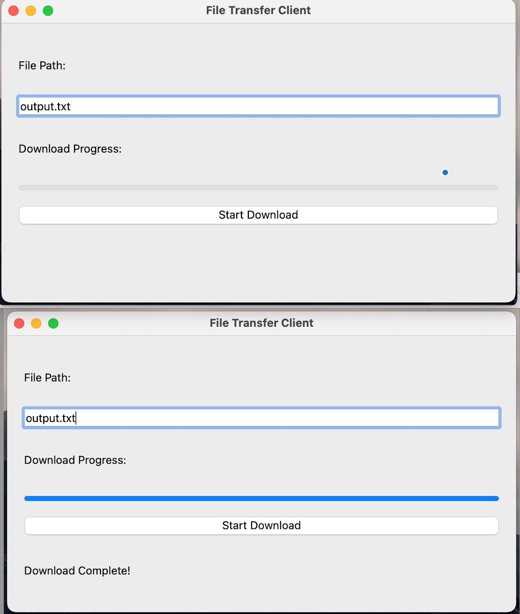

# File Transfer Client-Server Application

This project implements a simple file transfer system using UDP sockets, designed to split large files into smaller chunks for efficient downloading. It consists of a **client-server** architecture, where the server serves file data and the client requests and assembles the file chunks. A **PyQt5** graphical user interface (GUI) has been added for a better user experience.

## Features

- **Client**:
  - Requests file size from the server.
  - Downloads file in chunks (using multiple concurrent threads for better performance).
  - Displays download progress with a progress bar.
  - Saves the downloaded file to the user-specified location.

- **Server**:
  - Listens for client requests on a specified port.
  - Returns the requested file chunks along with MD5 hash for validation.
  - Handles requests for file size and specific file blocks.

- **GUI**:
  - Simple and intuitive interface built with PyQt5.
  - Input for the destination file path.
  - Progress bar to display download progress.
  - Status updates during the download process.

## Requirements

- Python 3.7 or higher
- PyQt5 (for the GUI)
- Additional libraries: `concurrent.futures`, `socket`, `json`, `hashlib`

## Installation

1. Clone the repository:

    ```bash
    git clone https://github.com/yourusername/file-transfer-client-server.git
    cd file-transfer-client-server
    ```

2. Install the required dependencies:

    ```bash
    pip install pyqt5
    ```

3. Run the server script to start the server:

    ```bash
    python server/main.py
    ```

4. Run the client script to start the GUI client:

    ```bash
    python client_gui.py
    ```

## Usage

1. After starting the server, run the client script.
2. In the client GUI:
   - Enter the desired file path for saving the downloaded file.
   - Click on **"Start Download"** to begin the download.
   - The progress bar will update as the file is downloaded.



## How It Works

1. **Client** sends a request for the file size to the server.
2. The **server** responds with the file size.
3. The **client** splits the file into smaller blocks and requests them in parallel using multiple threads.
4. **Server** serves each requested block and computes the MD5 hash for integrity.
5. The **client** assembles the blocks and saves the file to the specified location.


